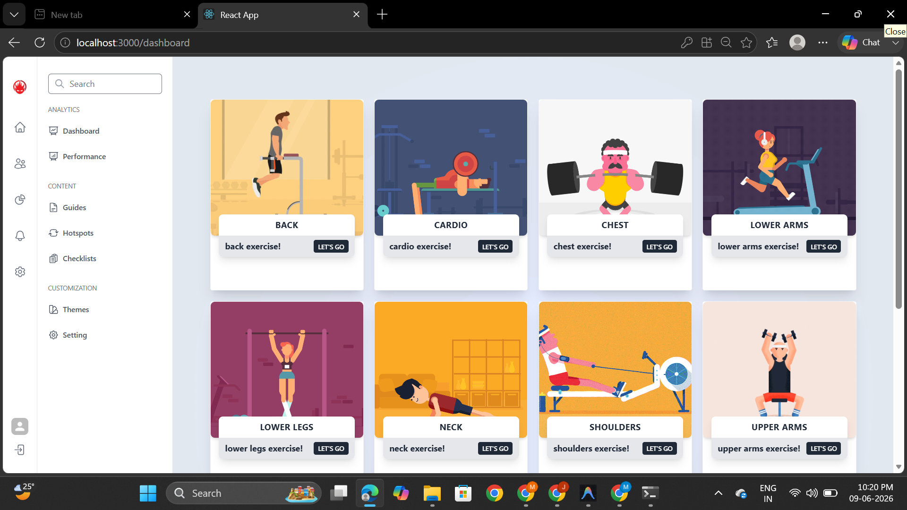
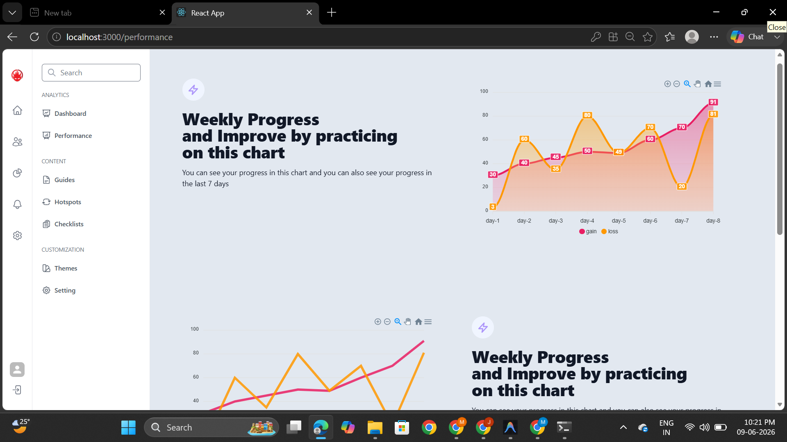
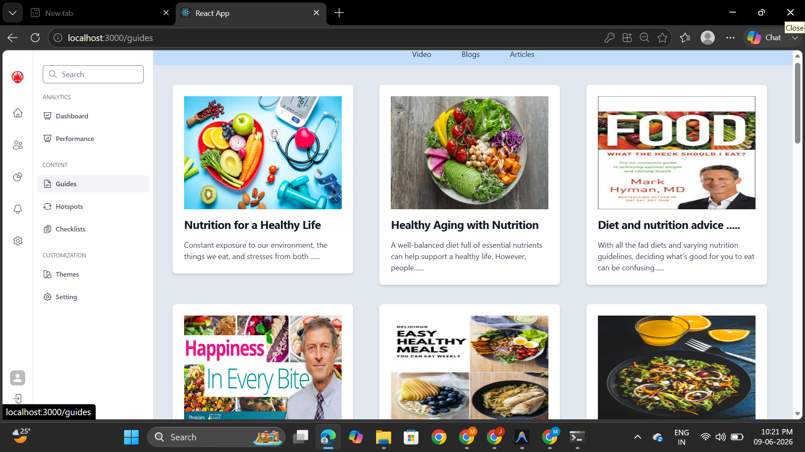
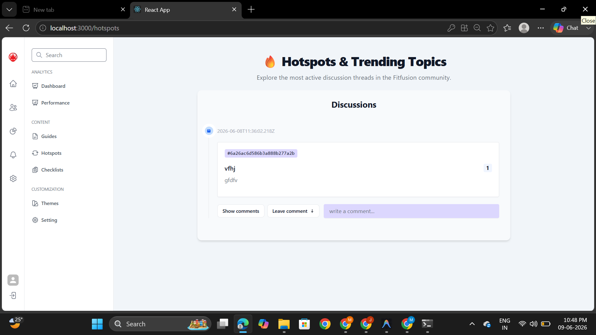
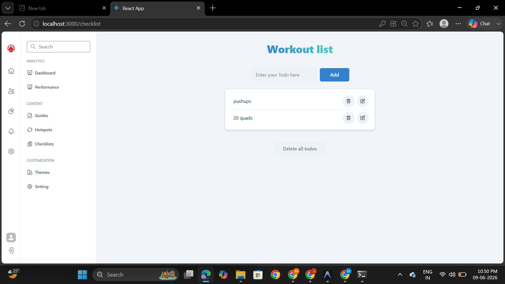
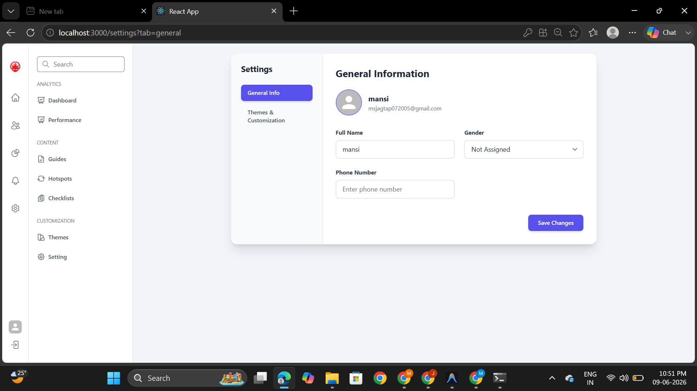

# FitFusion - Fitness Dashboard

FitFusion is a fitness management web application developed using the MERN stack. The platform helps users manage their fitness activities through workout tracking, exercise exploration, performance monitoring, and fitness-related resources.

The application includes Google Authentication and provides various tools that support users in maintaining a consistent fitness routine.

## Features

* Google Sign-In Authentication
* Personalized Fitness Dashboard
* Exercise Library with Search and Filters
* Weekly Performance Tracking
* Workout Checklist Management
* Fitness Guides and Resources
* Hotspots Section
* User Profile and Settings Management
* Responsive User Interface

## Tech Stack

### Frontend

* React.js
* Redux
* TypeScript
* Tailwind CSS

### Backend

* Node.js
* Express.js

### Database

* MongoDB

### Authentication

* Google OAuth

## Screenshots

### Signup Page

Users can create an account or log in using Google Authentication.


### Home Page

The home page provides access to all major features of the application.


### Dashboard

The dashboard serves as the central hub for fitness tracking and navigation.



### Weekly Performance

Track workout progress and performance using visual analytics.



### Fitness Guides

A collection of guides and resources related to fitness and healthy living.



### Hotspots

Explore fitness-related recommendations and activity sections.



### Workout Checklists

Manage daily workout tasks and maintain consistency.



### Settings

Update profile information and customize application preferences.



## Project Structure

```text
fitfusion-hackathon-winning-project
│
├── backend
│   ├── confgs
│   ├── models
│   ├── router
│   └── index.js
│
├── frontend
│   ├── public
│   ├── src
│   └── package.json
│
├── screenshots
└── README.md
```
